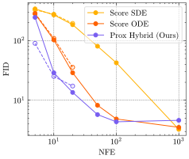

# ProxDM

Official implementation of [Beyond Scores: Proximal Diffusion Models](https://arxiv.org/abs/2507.08956).

**To appear in NeurIPS 2025.**

by [Zhenghan Fang](https://zhenghanfang.github.io/), [Mateo Díaz](https://mateodd25.github.io/), [Sam Buchanan](https://sdbuchanan.com/), and [Jeremias Sulam](https://jsulam.github.io/)

--------------------

We introduce a new framework for diffusion models based on backward discretization and proximal operators. Our **Proximal Diffusion Models (ProxDM)** achieve faster theoretical convergence rate and superior empirical sample quality under limited sampling steps.


<p align="center">
  <strong>FID on CIFAR-10</strong><br>
  <br>
  <em>ProxDM achieves lower FID with fewer steps.</em>
</p>


## Environment
Install the dependencies via conda:
```
conda env create -f environment.yml
conda activate prox_diffusion
```

or [uv](https://github.com/astral-sh/uv):
```
uv sync
source .venv/bin/activate
```

## Pretrained Models
All pretrained models are available on [HuggingFace](https://huggingface.co/ZhenghanFang/prox-diffusion/tree/main). 

Download the models manually to `assets/pretrained_models/`, or run `scripts/download_models_and_fid_stats.sh`.


## Data Preparation

#### Datasets
* **Datasaurus Dozen**: Download the csv file from [here](https://www.openintro.org/data/index.php?data=datasaurus) to `data/datasaurus/datasaurus.csv`.

* You can download the **MNIST** and **CIFAR-10** datasets using `torchvision` by running:
```
python scripts/download_datasets.py
```
- **MNIST**: stored in `data/mnist/`
- **CIFAR-10**: stored in `data/cifar10/`

#### Reference statistics for FID
Reference FID statistics for MNIST and CIFAR10 are available on [HuggingFace](https://huggingface.co/ZhenghanFang/prox-diffusion/tree/main).

Download the stats manually to `assets/fid_stats/{mnist,cifar10}.npz`, or run `scripts/download_models_and_fid_stats.sh`.

To self-compute reference stats, see `scripts/prepare_fid_stats.py`.

## Synthetic Example (Datasaurus "dino")

This experiment evaluates score-based and proximal samplers on a 2D mixture of Dirac deltas (the `dino` dataset in Datasaurus), using exact score and proximals, and computes Wasserstein distances to the target distribution.

1. Generate samples and compute Wasserstein distances:
```bash
python scripts/low_dim_experiment/sample.py
```
Results will be saved in `output/low_dim/dino/`.

2. Run `scripts/low_dim_experiment/plot.ipynb` to produce the figures in the paper.


## Experiments on MNIST and CIFAR-10

### Training

We provide commands to reproduce all ProxDM training experiments in the paper:
```sh
# MNIST Score
accelerate launch --multi_gpu --num_processes 4 train.py \
--config configs/mnist/score.py --ckpt_dir output/train/mnist/score

# MNIST Prox Hybrid
accelerate launch --multi_gpu --num_processes 4 train.py \
--config configs/mnist/prox_hybrid.py --ckpt_dir output/train/mnist/prox_hybrid

# MNIST Prox Backward
accelerate launch --multi_gpu --num_processes 4 train.py \
--config configs/mnist/prox_backward.py --ckpt_dir output/train/mnist/prox_backward

# CIFAR10 Score
accelerate launch --multi_gpu --num_processes 4 train.py \
--config configs/cifar10/score.py --ckpt_dir output/train/cifar10/score \

# CIFAR10 Prox Hybrid
accelerate launch --multi_gpu --num_processes 4 train.py \
--config configs/cifar10/prox_hybrid.py --ckpt_dir output/train/cifar10/prox_hybrid \

# CIFAR10 Score (5, 10, 20 steps)
accelerate launch --multi_gpu --num_processes 4 train.py \
--config configs/cifar10/score_subset.py --ckpt_dir output/train/cifar10/score_subset \

# CIFAR10 Prox Hybrid (5, 10, 20 steps)
accelerate launch --multi_gpu --num_processes 4 train.py \
--config configs/cifar10/prox_hybrid_subset.py --ckpt_dir output/train/cifar10/prox_hybrid_subset \

# CIFAR10 Prox Hybrid (5, 10, 20 steps, No heur.)
accelerate launch --multi_gpu --num_processes 4 train.py \
--config configs/cifar10/prox_hybrid_subset_noheur.py --ckpt_dir output/train/cifar10/prox_hybrid_subset_noheur \
```


### Evaluation (Compute FID)

We provide commands to reproduce all FID results in the paper:
```sh
BATCH_SIZE=10000

# MNIST Score
python eval.py \
--config configs/mnist/score.py \
--ckpt_path assets/pretrained_models/mnist_score.pth --output_root output/eval \
--config.fid.n_samples 50000 --config.fid.batch_size $BATCH_SIZE \

# MNIST Score ODE
python eval.py \
--config configs/mnist/score.py \
--ckpt_path assets/pretrained_models/mnist_score.pth --output_root output/eval \
--config.fid.n_samples 50000 --config.fid.batch_size $BATCH_SIZE \
--config.fid.sample_method ode_euler_eps \

# MNIST Prox Hybrid
python eval.py \
--config configs/mnist/prox_hybrid.py \
--ckpt_path assets/pretrained_models/mnist_prox_hybrid.pth --output_root output/eval \
--config.fid.n_samples 50000 --config.fid.batch_size $BATCH_SIZE \

# MNIST Prox Backward
python eval.py \
--config configs/mnist/prox_backward.py \
--ckpt_path assets/pretrained_models/mnist_prox_backward.pth --output_root output/eval \
--config.fid.n_samples 50000 --config.fid.batch_size $BATCH_SIZE \
--config.fid.steps "(20,50,100,1000)" \

# CIFAR10 Score
python eval.py \
--config configs/cifar10/score.py \
--ckpt_path assets/pretrained_models/cifar10_score.pth --output_root output/eval \
--config.fid.n_samples 50000 --config.fid.batch_size $BATCH_SIZE \

# CIFAR10 Score ODE
python eval.py \
--config configs/cifar10/score.py \
--ckpt_path assets/pretrained_models/cifar10_score.pth --output_root output/eval \
--config.fid.n_samples 50000 --config.fid.batch_size $BATCH_SIZE \
--config.fid.sample_method ode_euler_eps \

# CIFAR10 Prox Hybrid
python eval.py \
--config configs/cifar10/prox_hybrid.py \
--ckpt_path assets/pretrained_models/cifar10_prox_hybrid.pth --output_root output/eval \
--config.fid.n_samples 50000 --config.fid.batch_size $BATCH_SIZE \

# CIFAR10 Score (5, 10, 20 steps)
python eval.py \
--config configs/cifar10/score_subset.py \
--ckpt_path assets/pretrained_models/cifar10_score_subset.pth --output_root output/eval \
--config.fid.n_samples 50000 --config.fid.batch_size $BATCH_SIZE \
--config.fid.steps "(5,10,20)" \

# CIFAR10 Score ODE (5, 10, 20 steps)
python eval.py \
--config configs/cifar10/score_subset.py \
--ckpt_path assets/pretrained_models/cifar10_score_subset.pth --output_root output/eval \
--config.fid.n_samples 50000 --config.fid.batch_size $BATCH_SIZE \
--config.fid.steps "(5,10,20)" \
--config.fid.sample_method ode_euler_eps \

# CIFAR10 Prox Hybrid (5, 10, 20 steps)
python eval.py \
--config configs/cifar10/prox_hybrid_subset.py \
--ckpt_path assets/pretrained_models/cifar10_prox_hybrid_subset.pth --output_root output/eval \
--config.fid.n_samples 50000 --config.fid.batch_size $BATCH_SIZE \
--config.fid.steps "(5,10,20)" \

# CIFAR10 Prox Hybrid (5, 10, 20 steps, No heur.)
python eval.py \
--config configs/cifar10/prox_hybrid_subset_noheur.py \
--ckpt_path assets/pretrained_models/cifar10_prox_hybrid_subset_noheur.pth --output_root output/eval \
--config.fid.n_samples 50000 --config.fid.batch_size $BATCH_SIZE \
--config.fid.steps "(5,10,20)" \
```


## References
If you find the code useful for your research, please consider citing
```bib
@article{fang2025beyond,
  title={Beyond Scores: Proximal Diffusion Models},
  author={Fang, Zhenghan and D{\'\i}az, Mateo and Buchanan, Sam and Sulam, Jeremias},
  journal={arXiv preprint arXiv:2507.08956},
  year={2025}
}
```

## Acknowledgements
* [score_sde_pytorch](https://github.com/yang-song/score_sde_pytorch) (provide reference for baseline score-based samplers)
* [pytorch-ddpm](https://github.com/w86763777/pytorch-ddpm) (provide implementation of U-Net architecture)
* [pytorch-fid](https://github.com/mseitzer/pytorch-fid) (provide FID implementation in PyTorch)

For questions or comments, please contact `zfang23@jhu.edu`.